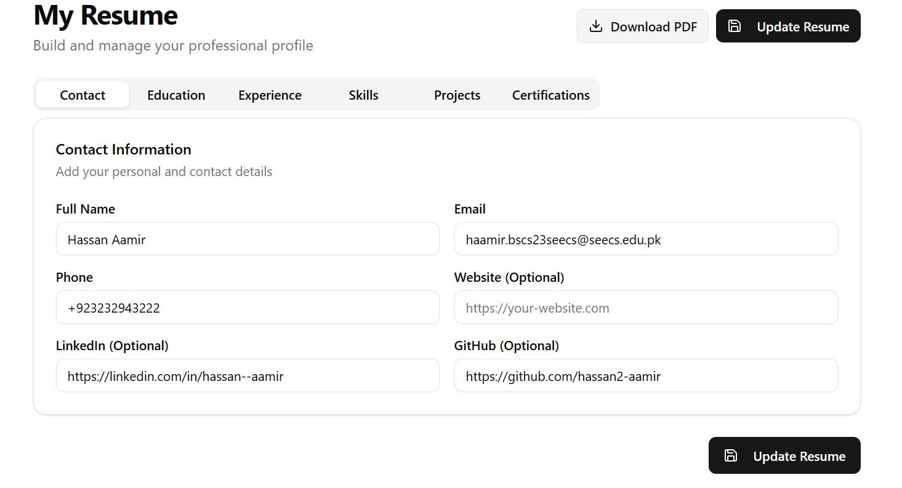
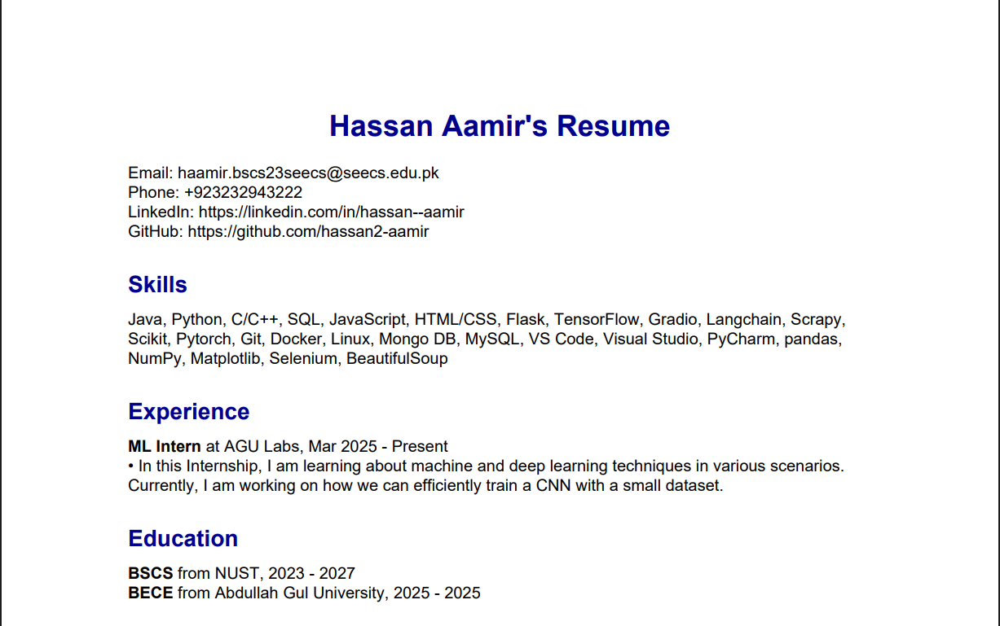
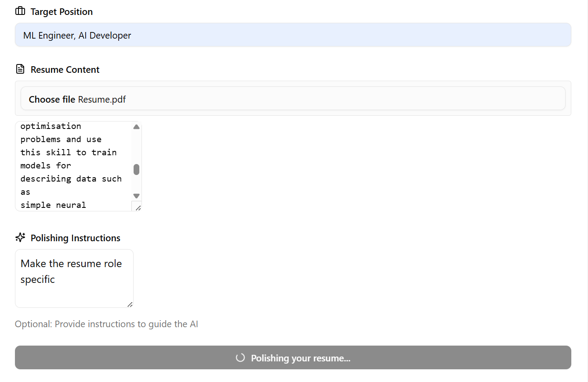
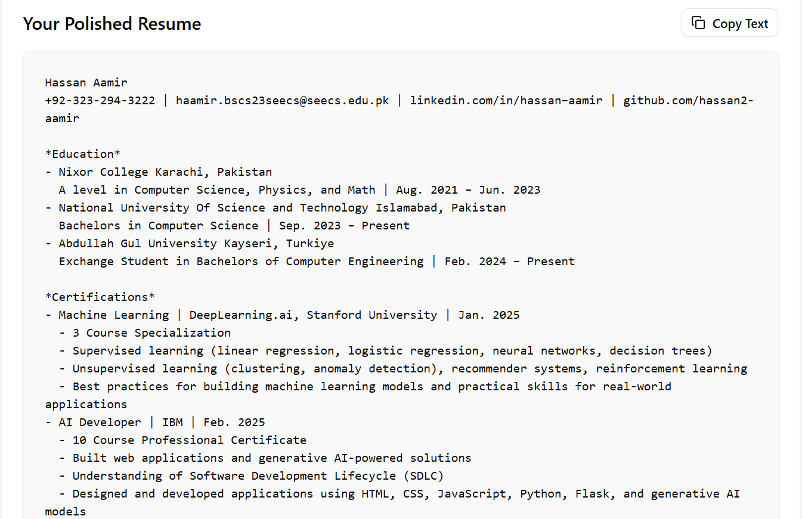
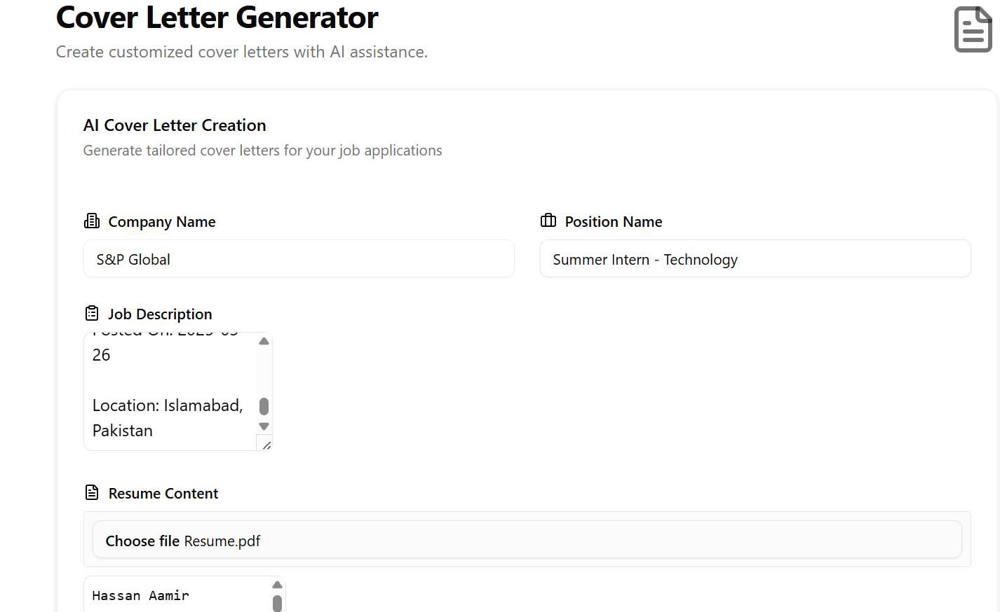
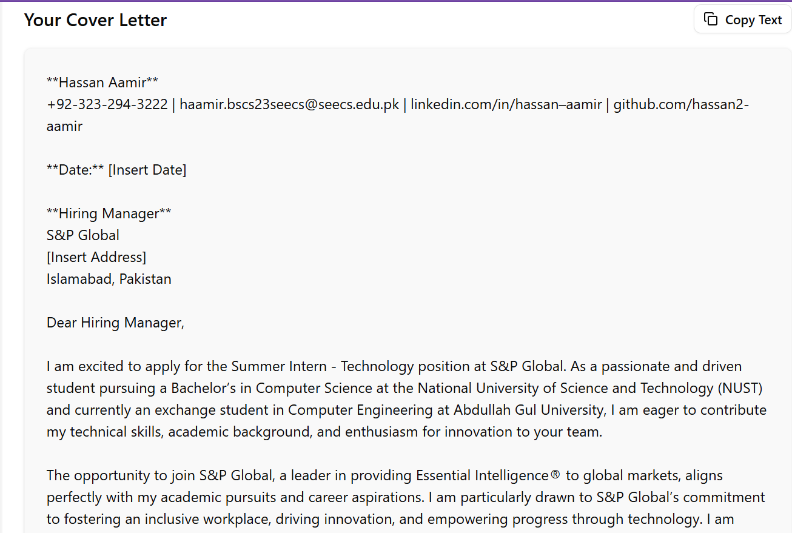
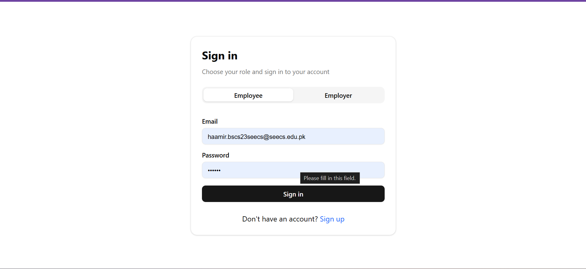

# SE_Project

This repository contains a comprehensive project designed to assist users in building, polishing, and managing resumes and cover letters. The project is built with a modern tech stack, including React, TypeScript, Vite, and Python, and integrates AI-powered tools for resume enhancement.

## Features

- **Resume Builder**: Create and manage resumes with an intuitive interface.
- **Resume Polisher**: AI-powered tool to enhance resumes for specific job positions.
- **Cover Letter Generator**: Generate tailored cover letters based on job descriptions.
- **PDF Export**: Download resumes and cover letters in PDF format.
- **User Authentication**: Role-based authentication for employees and employers.

## Tech Stack

### Frontend
- **React** with **TypeScript**
- **Vite** for fast development
- **Tailwind CSS** for styling
- **Radix UI** components
- **Lucide Icons**

### Backend
- **Python** with **Flask**
- **Gradio** for AI interface
- **ReportLab** for PDF generation

### Database
- **MySQL** for data storage

### AI Integration
- **OpenRouter AI** for resume polishing and cover letter generation.

## Installation

### Prerequisites
- Node.js and npm
- Python 3.x
- MySQL

### Steps
1. Clone the repository:
    ```bash
    git clone https://github.com/your-repo/SE_Project.git
    cd SE_Project
    ```

2. Install frontend dependencies:
    ```bash
    cd frontend
    npm install
    ```

3. Install backend dependencies:
    ```bash
    cd ../app
    pip install -r requirements.txt
    ```

4. Set up the database:
    - Create a MySQL database.
    - Run the SQL script in `database script.sql` to set up tables.

5. Configure environment variables:
    - Create a `.env` file in the `app` directory.
    - Add your `API_KEY` and database credentials.

6. Start the development servers:
    - Frontend:
      ```bash
      cd frontend
      npm run dev
      ```
    - Backend:
      ```bash
      cd ../app
      python resume_polisher.py
      ```

## Usage

1. Open the frontend in your browser at `http://localhost:3000`.
2. Log in or sign up as an employee or employer.
3. Use the tools to build, polish, and manage resumes and cover letters.

## Project Structure

```
SE_Project/
├── app/                # Backend code
├── frontend/           # Frontend code
├── database script.sql # Database schema
├── LICENSE             # License file
└── README.md           # Project documentation
```
## Demo

### Demo

Below are some screenshots showcasing the features of the project:

#### Resume Builder




#### Resume Polisher



#### Cover Letter Generator



#### Login Page


## License

This project is licensed under the [MIT License](LICENSE).

## Contributing

Contributions are welcome! Please fork the repository and submit a pull request.

## Acknowledgments

- [Radix UI](https://www.radix-ui.com/)
- [OpenRouter AI](https://openrouter.ai/)
- [ReportLab](https://www.reportlab.com/)
- [Tailwind CSS](https://tailwindcss.com/)
- [Lucide Icons](https://lucide.dev/)  